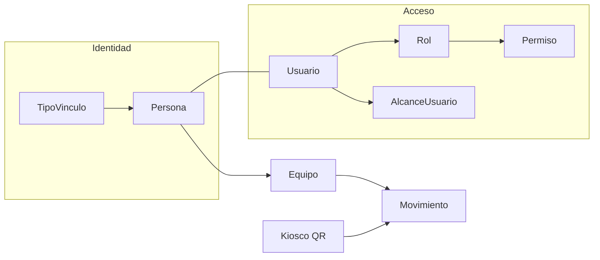

# Contexto completo del sistema

**Proyecto:** Sistema de Control de Salida de Equipos de Cómputo  
**Institución:** Universidad de Cundinamarca  
**Estado:** Vigente (síntesis operativa alineada al código y al seed)  
**Fecha:** 2026-09-22 (Resend + Celery; Área→sede; alcance + login cédula)  

> **Punto de entrada canónico.** Si hay conflicto con documentos antiguos (`01`, `02`, `08`, etc.), **gana este archivo** y el código. Los `00`–`17` siguen como detalle; ver sección 14.

---

## 1. Qué es el sistema

La universidad controla la **salida** de equipos de cómputo (personales e institucionales) del campus:

1. Cada miembro de la comunidad registra sus equipos una vez.
2. Al salir, muestra un **código QR** (celular o pantalla).
3. En portería se escanea el QR y el sistema confirma si persona y equipo coinciden.

No hay control de ingreso. Cada escaneo genera un `Movimiento` (auditoría), incluso si hay alerta.

---

## 2. Stack y layout del repositorio

| Capa | Tecnología |
|------|------------|
| Backend | Python + Django 5.1 |
| Base de datos | PostgreSQL |
| Frontend | Templates Django + HTMX (sin SPA) |
| Estilos | `static/css/custom.css` + Bootstrap 5.3 (CDN) |
| QR | `qrcode` + Pillow; exhibición con token firmado TTL |
| Reportes | `xlsxwriter` (Excel) + Chart.js (dashboard en pantalla) |
| Auth extra | django-axes, Argon2, django-otp (MFA), django-ratelimit |
| Correo | Resend (API) + adapter/mock; plantillas en `notifications` |
| Cola | Celery + Redis (cola `emails`); en DEBUG, eager + mock |
| Caché | LocMemCache (agregados del dashboard) |
| Despliegue | Render (Docker web + worker + Redis Key Value + PostgreSQL); ver `contexto/operaciones/despliegue-render.md` |

```
sistema de control/
├── config/                 # settings, urls, middleware, wsgi, celery
├── apps/
│   ├── accounts/           # Usuario, Rol, Permiso, login, registro, MFA, reset password
│   ├── organizacion/       # Sede, Facultad, Programa, Área→Sede, AlcanceUsuario
│   ├── personas/           # Persona, TipoVinculo, VisitaExterno
│   ├── equipos/            # Equipo, QR, AsignacionEquipo
│   ├── control_acceso/     # Kiosco, Movimiento
│   ├── panel/              # Administración interna /panel/ (+ monta dashboard)
│   ├── auditoria/          # AuditoriaCambio
│   ├── reportes/           # Excel + dashboard (KPIs/Chart.js)
│   ├── notifications/      # EmailLog, EmailToken, tasks, webhook Resend
│   └── integrations/       # Resend adapter/client/mock (paquete Python)
├── templates/
├── static/
├── Dockerfile              # Imagen de producción (Render / compose)
├── docker-compose.yml      # web + Postgres + Redis + worker Celery
├── render.yaml             # Blueprint: DB + Redis + web + worker
├── contexto/               # Documentación (este archivo = entrada)
└── manage.py
```

Comandos habituales:

```bash
python manage.py migrate
python manage.py seed_data
python manage.py runserver
# Producción local (Docker): docker compose up --build
```

---

## 3. Apps y responsabilidades

| App | Responsabilidad |
|-----|-----------------|
| `accounts` | Auth, roles/permisos dinámicos, **alcance jerárquico** (`alcance.py`), registro externo, MFA TOTP, mi perfil |
| `organizacion` | Catálogos multi-sede: Sede, Facultad, Programa, **Área (FK sede)**, `ResponsableDependencia`, `AlcanceUsuario` |
| `personas` | Ficha de comunidad académica + TipoVinculo |
| `equipos` | Inventario, generación/exhibición de QR |
| `control_acceso` | Kiosco de portería + historial de movimientos |
| `panel` | CRUD interno (personas, usuarios, roles, organización); URLs del dashboard |
| `auditoria` | Traza de cambios sensibles y exportaciones |
| `reportes` | Exportaciones `.xlsx` + dashboard admin (agregados, filtros HTMX, Chart.js) |
| `notifications` | Cola de correos (`EmailLog`), tokens (`EmailToken`), webhook Svix, tasks Celery |
| `integrations.resend` | Cliente/adapter Resend (mock en local); no es app Django |

---

## 4. Identidad vs acceso

El sistema separa dos conceptos:

| Concepto | Pregunta | Entidades |
|----------|----------|-----------|
| **Identidad institucional** | ¿Quién es en la universidad? | `Persona` + `TipoVinculo` |
| **Acceso al sistema** | ¿Qué puede hacer en la app? | `Usuario` + `Rol` + `Permiso` |
| **Alcance de filas** | ¿Sobre qué sedes/unidades ve datos? | `AlcanceUsuario` (ortogonal a permisos) |



- `Persona` no inicia sesión por sí sola; se vincula 1:1 opcional a `Usuario`.
- Un admin/operador puede ser `Usuario` sin `Persona`.
- Autorización: `usuario.tiene_permiso("codigo")` consulta roles activos → permisos.
- Visibilidad de filas: `aplicar_alcance(user, qs)` / helpers en `apps/accounts/alcance.py`. FUSA = usuario con nivel `global` (sin hardcode de sede).

---

## 5. Organización institucional

### 5.1 Jerarquía vigente

```
Sede ──────────────┬──► Programa (sede + facultad)
                   └──► Área / Dependencia (FK sede; unicidad sede+codigo)
Facultad (indep.) ─┘
                   ├──► Persona (sede obligatoria + programa | área de la misma sede)
                   ├──► Equipo personal (persona obligatoria)
                   └──► Equipo institucional (unidad propietaria facultad|programa|área +
                        estado_inventario; AsignacionEquipo opcional)
```

| Entidad | Descripción | Ejemplo seed |
|---------|-------------|--------------|
| **Sede** | Ubicación física (seccional / extensión / sede) | 7 códigos: CHIA, FACA, FUSA, GIR, SOACHA, UBATE, ZIPA |
| **Facultad** (`Decanatura`) | Unidad académica **transversal** (no depende de sede) | 7 facultades (FAC-ING, FAC-ADM, …) |
| **Programa** | Carrera ofrecida en **una** sede bajo una facultad | 45 programas (código único global, p. ej. `ISC-UBATE`) |
| **Área** | Dependencia administrativa **de una sede** | 8 códigos × cada sede activa (p. ej. CGCA en Ubaté **y** en Fusa = 2 filas) |

> Nota: docs antiguos `01`/`02` describían `Sede → Decanatura → Programa` y Área independiente. El modelo vigente: Facultad independiente; **Área siempre con sede** (migración `organizacion.0007_area_sede`). Plan: [`planes/area-pertenece-sede.md`](planes/area-pertenece-sede.md).

### 5.2 Modelo `Area` (detalle)

| Campo / regla | Valor |
|---------------|--------|
| `sede` | `ForeignKey(Sede, on_delete=RESTRICT, related_name="areas")` — **obligatorio** |
| `codigo` | Corto institucional (CGCA, ISU, …); **no** único solo |
| Unicidad | `UniqueConstraint(sede, codigo)` → `uniq_area_sede_codigo` |
| Índice | `(sede, activo)` → `area_sede_id_activo_idx` |
| `__str__` | `CGCA — Biblioteca (UBATE)` |
| Borrado | Lógico (`activo`); RESTRICT impide borrar sede con áreas |

Códigos del catálogo seed (`seed_organizacion_data.AREAS`): `ADMIS`, `BIEN`, `CGCA`, `CTEI`, `DIRADM`, `INTL`, `ISU`, `TESOR`.

### 5.3 Persona ↔ organización

- **Sede** siempre obligatoria.
- Perfiles académicos (`creador_oportunidades`, `gestor_conocimiento`, `egresado`): programa opcional de **esa** sede; sin área.
- `gestor_administrativo`: **sin** área ni programa en autorregistro (área pendiente). Un admin con `personas.administrar` asigna después el área; debe cumplir `area.sede_id == persona.sede_id`.
- `personal_externo`: no usa `Persona.area`/`programa` de forma fija; el destino va en `VisitaExterno` (sede + unidad). Si la unidad es área, esa fila de `Area` debe ser de la sede de la visita.
- UI: selects de área/programa se **filtran por sede** (panel persona, registro externo, nueva visita).

### 5.4 Alcance sobre áreas

Con alcance nivel `sede`, el usuario ve **todas** las áreas de esas sedes (`_q_area`: `sede_id__in` ∪ `pk__in` por dependencia explícita). Crear áreas nuevas en catálogo exige alcance `global` (igual que sedes/programas).

### 5.5 Seed de áreas

`_cargar_areas` hace upsert **por cada sede activa × cada código** del catálogo. No soft-desactiva áreas ajenas. Tras 7 sedes × 8 códigos → **56** filas tipicas. Ver también [`planes/seed-automatico-render.md`](planes/seed-automatico-render.md).

---

## 6. Roles y permisos vigentes

Fuente canónica: `apps/accounts/management/commands/seed_data.py`.

### Roles

| Rol (BD) | Activo | Permisos |
|----------|--------|----------|
| `admin_sistema` | Sí | Todos (18) |
| `miembro_comunidad` | Sí | `equipos.registrar`, `equipos.ver_propios`, `perfil.ver_propio` |
| `responsable_dependencia` | Sí | `equipos.inventario_institucional`, `equipos.asignar_institucional` |
| `vigilante` | Sí | `control.escanear`, `control.ver_alertas` |
| `celador` | **No** (legado) | mismos que vigilante |

El rol **vigilante** opera el kiosco; se crea por alta interna (Persona + Usuario, una sede, correo libre). Al crearse recibe alcance `SEDE` de su persona. `admin_sistema` también tiene `control.escanear`. El responsable de dependencia inventaría y asigna equipos institucionales en las unidades de su alcance y/o filas en `responsable_dependencia`.

### Alcance jerárquico (ortogonal a permisos)

Los **permisos** definen *qué puede hacer*; el **alcance** define *sobre qué filas* ve y edita. Modelo `AlcanceUsuario` (`organizacion.alcance_usuario`): un usuario puede tener varias filas (unión); `GLOBAL` gana sobre el resto.

| Nivel | Ve |
|-------|-----|
| `global` | Todo (caso FUSA — no hardcodeado) |
| `sede` | Su sede + programas de esa sede + **áreas de esa sede** |
| `facultad` | Personas/programas/equipos de esa facultad |
| `programa` | Solo ese programa |
| `area` | Solo esa dependencia (fila `Area` concreta, ya ligada a una sede) |

Filtrado central: `apps/accounts/alcance.py` (`aplicar_alcance`, helpers `personas_visibles`, `equipos_visibles`, `areas_visibles`, etc.). Para `organizacion.Area`, `_q_area` une `sede_id__in=alcance.sedes` y `pk__in=alcance.areas`. Reportes: `acotar_por_alcance` en `reportes/filtros.py`. Permiso `usuarios.gestionar_alcance` para asignar alcance a otros (no ampliar el propio ni otorgar nivel superior al del actor).

### Permisos (18)

| Código | Uso |
|--------|-----|
| `equipos.registrar` | Alta de equipos **personales** propios (autoregistro; no mezcla con institucionales) |
| `equipos.ver_propios` | Ver/mostrar QR propio |
| `equipos.ver_todos` | Inventario completo |
| `equipos.inventario_institucional` | Alta de equipos institucionales **sin persona** (pool de la unidad) |
| `equipos.asignar_institucional` | Asignar / renovar / reasignar / devolver / baja de institucionales (alcance por unidad) |
| `equipos.gestionar_responsables` | CRUD de `responsable_dependencia` (MVP: solo admin) |
| `control.escanear` | Kiosco de salida |
| `control.ver_alertas` | Historial / alertas |
| `catalogos.administrar` | Sedes, facultades, programas, áreas, vínculos |
| `personas.administrar` | CRUD personas |
| `usuarios.administrar` | Usuarios / reset password / inactivar |
| `usuarios.desbloquear` | Desbloquear login bloqueado por Axes (intentos fallidos) |
| `usuarios.gestionar_alcance` | Asignar alcance jerárquico a otros usuarios |
| `roles.administrar` | Roles + matriz |
| `permisos.ver` | Catálogo de permisos (solo lectura) |
| `perfil.ver_propio` | Mi perfil |
| `reportes.ver` | Dashboard + configurar filtros de reportes (solo agregados en pantalla) |
| `reportes.exportar` | Descargar Excel con datos fila a fila |

Los permisos se cargan por migración/seed; el panel no los crea, solo los asigna a roles.

---

## 7. TipoVinculo (perfiles universitarios)

Catálogo dinámico. **No es rol de acceso:** todos los que se autoregistran reciben `miembro_comunidad` vía `TipoVinculo.rol_asignado`.

| Código | Nombre visible | Autoregistro | Correo | Organización / notas |
|--------|----------------|--------------|--------|----------------------|
| `gestor_administrativo` | Gestor Administrativo | Sí | `@ucundinamarca.edu.co` | Área pendiente al registrarse; la asigna admin después (sin programa) |
| `creador_oportunidades` | Creador de Oportunidades | Sí | `@ucundinamarca.edu.co` | Programa opcional |
| `gestor_conocimiento` | Gestor del Conocimiento | Sí | `@ucundinamarca.edu.co` | Programa opcional |
| `egresado` | Egresado | Sí | `@ucundinamarca.edu.co` | Programa opcional |
| `personal_externo` | Personal Externo | Sí | **cualquier correo** | VisitaExterno (sede + dependencia + vigencia); rol `miembro_comunidad` |
| `vigilante` | Vigilante | **No** (alta interna) | **cualquier correo** | Una sede; rol `vigilante` |

Si `dominio_correo_requerido` es NULL, no se exige dominio institucional.

---

## 8. Entidades clave y reglas de negocio

### Equipo

- `serial` único en todo el sistema.
- `token_qr` UUID interno; el QR de exhibición usa token **firmado con TTL** (default 300 s).
- Propiedad: `personal` o `institucional`.
- **Personal:** lo registra la persona en Mis equipos (`equipos.registrar`); `persona` obligatoria; sin unidad.
- **Institucional:**
  - Unidad propietaria permanente en `Equipo.unidad_tipo` / `unidad_id` (facultad / programa / área).
  - `estado_inventario`: `disponible` (sin persona) | `asignado` | `de_baja`.
  - `persona` **nullable**: `NULL` mientras está disponible en inventario.
  - Alta: `/panel/equipos/institucionales/nuevo/` (`equipos.inventario_institucional`) — **sin elegir persona**.
  - Si `unidad_tipo=area`, se sincroniza `dependencia` (FK a la fila `Area` de esa sede; el mismo código en otra sede es otra fila).
- Una persona **nunca** se autoasigna un institucional; el autoregistro personal no se mezcla con este flujo.
- El titular ve el institucional en Mis equipos (badge + QR) solo mientras esté asignado a él.
- Si `activo=false` / `de_baja`, el escaneo genera alerta.

### AsignacionEquipo

Historial de **préstamos a personas** (la unidad propietaria vive en `Equipo`, no se repite aquí):

| Campo | Regla |
|-------|--------|
| `fecha_inicio` / `fecha_fin` | Obligatorias; `fecha_fin >= fecha_inicio` |
| `estado` | `activa` \| `finalizada` \| `revocada` — **máximo una `activa` por equipo** |
| `persona` | Titular del periodo |
| `asignado_por_usuario` | Quién ejecutó la asignación |

Renovar / reasignar cierran la fila activa y crean una nueva. **Devolver al inventario** cierra la activa y deja `persona=NULL`, `estado_inventario=disponible`.

**Cierre automático al vencer:** al escanear (tiempo real) o con el command `cerrar_asignaciones_vencidas` (batch diario): `estado=finalizada`, equipo vuelve a `disponible`.

### VisitaExterno (doc 16)

Separación cuenta vs visita para `personal_externo` (simetría con equipo vs asignación):

| Campo | Regla |
|-------|--------|
| `persona` | Solo tipo `personal_externo` |
| `sede` / `unidad_tipo` / `unidad_id` | Destino autodeclarado (sin aprobación). Si `unidad_tipo=area`, `unidad_id` debe ser un `Area` de **esa** `sede` |
| `fecha_inicio` / `fecha_fin` | Obligatorias |
| `estado` | `activa` \| `finalizada` \| `cancelada` — máx. una `activa` por persona |

Primera visita en `/registro/`; siguientes en `/accounts/registrar-visita/`. Al vencer: cierre en escaneo o `cerrar_visitas_vencidas` — **no** se inactiva la Persona. En el formulario, el JS filtra programas y áreas por la sede elegida; el backend valida coherencia sede↔unidad.

### AlcanceUsuario

Tabla `alcance_usuario`: `usuario`, `nivel` (`global` / `sede` / `facultad` / `programa` / `area`), `objeto_id` (null solo si global), `activo`.

- Migración `organizacion.0005`: copia `ResponsableDependencia` → alcance equivalente; asigna `GLOBAL` a usuarios con rol `admin_sistema`; vigilantes con sede → alcance `sede`.
- Permiso `usuarios.gestionar_alcance` (migración `accounts.0011` + seed): UI en ficha de usuario del panel (alta/baja auditada). Un actor no puede ampliar su propio alcance ni otorgar uno superior al suyo.
- Badge del alcance propio en la topbar (`accounts.context_processors.alcance_usuario`).
- Reportes y dashboard delegan en `acotar_por_alcance` → `aplicar_alcance`.
- `es_admin_global()` en `equipos.services` = permiso/rol admin **y** alcance GLOBAL.

### ResponsableDependencia

Tabla que vincula un `Usuario` con una unidad (`facultad` / `programa` / `area`) para inventariar/asignar equipos institucionales. Complementa (no reemplaza) `AlcanceUsuario` para permisos de unidad.

### Movimiento

Cada escaneo crea un registro:

| Resultado | Significado |
|-----------|-------------|
| `ok` | Persona y equipo activos; si es institucional, asignación vigente hoy; si es externo, visita vigente |
| `alerta` | Inactivo, sin asignación/visita, vigencia inválida u anomalía |
| `no_encontrado` | QR/serial inexistente |

`motivo_alerta`: `equipo_inactivo`, `persona_inactiva`, `asignacion_vencida`, `asignacion_no_vigente`, `sin_asignacion_activa`, `visita_vencida`, `sin_visita_activa`, `no_coincide`.

`otra_sede`: flag si la sede de la persona ≠ sede del vigilante (salida sigue `ok` + badge).

### Reglas transversales

1. Un equipo personal tiene un único responsable (`Persona`); un institucional puede estar sin titular (`disponible`).
2. Solo quien tiene `control.escanear` usa el kiosco.
3. Persona o equipo inactivo → no salida válida (alerta).
4. Borrado lógico (`activo` / `de_baja`), no físico.
5. MFA obligatorio para usuarios con rol activo `admin_sistema`.
6. Vigilante pertenece a una sola sede; persona de otra sede → `ok` + badge «Otra sede».
7. Listados del panel, reportes, inventario e histórico de movimientos se filtran por `AlcanceUsuario` (sin alcance → queryset vacío salvo superusuario).
8. Catálogos: crear sedes/facultades/programas/áreas nuevas requiere alcance `global`; editar/listar solo lo visible. Al crear/editar **área**, la sede es obligatoria y el código es único **por sede**.
9. Coherencia sede↔área: no se asigna a una persona (ni a una visita) un área de otra sede.

---

## 9. Flujos principales

### 9.1 Autorregistro (`/registro/` → `/accounts/registro/`)

Público. Elige `TipoVinculo` con `permite_autoregistro=true` → crea atómicamente Persona + Usuario + `UsuarioRol` (nunca elige su rol).  
Si el vínculo exige `dominio_correo_requerido` (hoy `@ucundinamarca.edu.co`), el **username** es la parte local del correo (`juan.perez` para `juan.perez@ucundinamarca.edu.co`); el `email` queda completo. Sin dominio requerido (`personal_externo`), username = correo completo.  
Si el vínculo es **Gestor Administrativo**, el formulario **no** pide área ni programa (el área la asigna después un admin con `personas.administrar`, siempre de la **misma sede** de la persona); para el resto de comunidad, programa es opcional (filtrado por sede) y no se asigna área.  
Si es **Personal Externo**: correo libre + sede/dependencia/vigencia → también crea la primera `VisitaExterno`. Dependencia tipo área: solo áreas de la sede destino. Documento ya registrado como externo → hint de login + «Registrar nueva visita».

Tras el commit exitoso se encola correo **welcome** (no bloquea el acceso: la cuenta queda usable al instante; confirmación de email es fase 2, ver doc 17).

### 9.1b Vigilante (alta interna)

`/panel/personas/vigilante/nuevo/` (`personas.administrar`): Persona + Usuario + rol vigilante, una sede, correo libre (username = correo completo). No aparece en `/registro/`. Al crearse recibe `AlcanceUsuario(nivel=sede)` de su sede.

### 9.2 Login + MFA

`/accounts/login/` → Axes + rate limit. Identificador: **username**, **correo** o **número de documento** (cédula) vía `DocumentoOUsuarioBackend`. Enlace **«¿Olvidó su contraseña?»** → `/accounts/password-reset/` (throttle + mensaje anti-enumeración). Si es `admin_sistema`: configurar o verificar TOTP antes de abrir sesión. Redirect post-login:

1. `control.escanear` → kiosco  
2. `equipos.ver_propios` → Mis equipos  
3. `perfil.ver_propio` → Mi perfil  
4. (otros permisos de panel…)

### 9.3 Miembro: equipos y QR

Login → Mis equipos → registrar equipo **personal** → al salir mostrar QR. Exhibición: `TimestampSigner` (`salt=equipo-qr-exhibicion`). Escaneo acepta token firmado, UUID legado o serial. Los institucionales aparecen en Mis equipos solo para mostrar QR (sin editar/baja). Un personal **dado de baja** (`activo=false`) no es válido en kiosco; el dueño puede **dar de alta** de nuevo (mismo serial/QR) desde Mis equipos. Institucionales no se reactivan por esta vía.

### 9.3b Inventario y asignación institucional (docs 14 + 15)

1. Admin designa responsables en `/panel/responsables-dependencia/` (`equipos.gestionar_responsables`).
2. **Alta inventario** (`equipos.inventario_institucional`): `/panel/equipos/institucionales/nuevo/` → equipo `disponible`, sin persona, con unidad propietaria.
3. **Asignar** (`equipos.asignar_institucional`): `/panel/equipos/asignar-institucional/` elige un equipo `disponible`, persona de la unidad y fechas → `AsignacionEquipo` activa + `estado_inventario=asignado`.
4. Listado `/panel/equipos/institucionales/`: filtros inventario (disponible/asignado/de baja) y vigencia (vigente / por vencer ≤15 días / vencida).
5. Acciones: **Renovar**, **Reasignar**, **Devolver** (vuelve a disponible), **Dar de baja**.
6. Cierre automático al vencer: en kiosco al escanear, o job `manage.py cerrar_asignaciones_vencidas`.

### 9.4 Kiosco de portería (`/acceso/control-salida/`)

Tres vías al mismo endpoint HTMX:

1. Pistola / lector (teclado + Enter)  
2. Cámara (`html5-qrcode`; HTTPS o localhost)  
3. Entrada manual  

Semáforo: verde (`ok`), rojo (`alerta`), gris (`no_encontrado`).  
Institucional: si está `disponible` / sin asignación → alerta `sin_asignacion_activa`; si `fecha_fin < hoy` → **cierra** la asignación, deja disponible y alerta `asignacion_vencida`; si hoy &lt; inicio → `asignacion_no_vigente`; vigente → `ok` + badge de unidad.  
Personal externo: sin visita activa → `sin_visita_activa`; visita vencida → cierra y `visita_vencida`; vigente → `ok` + badge «Visitante externo — [Dependencia], hasta [fecha]».  
Otra sede (cualquier vínculo): si `persona.sede` ≠ sede del vigilante → `ok` + badge «Otra sede — [nombre]» (sin confirmación extra).

### 9.4b Nueva visita externo

`/accounts/registrar-visita/` (miembro `personal_externo`): declara sede/dependencia/vigencia; cierra la visita activa previa.

### 9.5 Panel interno (`/panel/`)

Administración universitaria (no Django Admin). Personas, usuarios (roles + **alcance**), roles, organización, equipos institucionales. Django Admin (`ADMIN_URL`) solo soporte técnico.

Con `reportes.ver`, `/panel/` redirige primero al **dashboard** (`panel:dashboard`). Los listados y selects de sede/programa/área usan helpers de alcance (`select_related("sede")` en áreas); detalle fuera de alcance → 404. Organización → Áreas muestra columna **Sede**; el formulario de área exige sede.

### 9.6 Dashboard administrador (`/panel/dashboard/`)

Vista en pantalla (doc [`13`](13-dashboard-administrador.md)); lógica en `apps/reportes/`, rutas bajo `/panel/`. **No** descarga datos personales crudos — solo agregados.

| Aspecto | Detalle |
|---------|---------|
| Permiso | Solo `reportes.ver` (no exige `reportes.exportar`) |
| Default | Periodo **Hoy** sin que el admin configure nada |
| Filtros | Preset fecha (hoy/ayer/7d/mes/custom), sede, tipo vínculo, resultado — HTMX sin recarga completa |
| KPIs periodo | Movimientos, alertas (+ %; acento danger si > umbral 5%) |
| KPIs estructurales | Equipos activos, personas activas («dato actual»; no cambian con el rango de fechas) |
| Extra | Sede con más movimiento (si hay >1 sede con datos) |
| Gráficos | Chart.js: línea temporal, dona resultados, barras por sede, top 5 alertas (personas), barras por `motivo_alerta` |
| Caché | LocMem: ~45 s agregados de periodo; ~5 min estructurales |
| Endpoints | `/panel/dashboard/`, `/parcial/`, `/datos-grafico/` (JSON combinado) |

Colores de resultado alineados al design system: OK `#007B3E`, alerta `#C62828`, no encontrado `#5B615D`.

### 9.7 Reportes Excel (`/reportes/`)

Cinco Excel: movimientos, equipos, personas, alertas, ejecutivo. Requiere `reportes.ver` para configurar y `reportes.exportar` para descargar; cada descarga queda en `auditoria_cambio`. El reporte de alertas filtra y columna por `motivo_alerta`. Export síncrono (límites en doc [`12`](12-modulo-reportes-excel.md)). **Todas las queries pasan por `acotar_por_alcance`** (mismo alcance que el panel). Complementa el dashboard de §9.6.

### 9.8 Correos transaccionales (Resend)

El **front nunca llama a Resend**. Flujo: vista → `EmailService` → `EmailLog(queued)` → task Celery cola `emails` → `ResendAdapter` → API. Webhook `POST /webhooks/resend/` (Svix) actualiza delivered/bounced/complained.

| Evento | Correo `email_type` |
|--------|---------------------|
| Registro OK | `welcome` |
| Olvidé / restablecer contraseña | `password_reset` (token HMAC, ~2 h) |
| Admin desbloquea Axes | `account_unlocked` |

Local: `RESEND_MOCK_MODE=True` (default con `DEBUG`) + `CELERY_TASK_ALWAYS_EAGER`. Producción: mock off, Redis + worker, API key y webhook secret. Detalle: [`17-integracion-resend.md`](17-integracion-resend.md).

---

## 10. URLs principales

| Ruta | Destino |
|------|---------|
| `/` | Redirect al kiosco |
| `/registro/` | Autorregistro |
| `/accounts/registrar-visita/` | Nueva visita (personal externo) |
| `/panel/personas/vigilante/nuevo/` | Alta interna de vigilante |
| `/legal/politica-datos/` | Política de datos personales |
| `{ADMIN_URL}` | Django admin (default `admin/`) |
| `/accounts/` | login, logout, registro, perfil, MFA |
| `/accounts/password-reset/` | Solicitar restablecimiento de contraseña |
| `/accounts/password-reset/confirmar/` | Confirmar token + nueva contraseña (`?token=`) |
| `/webhooks/resend/` | Webhook Svix Resend (csrf_exempt; firma requerida en prod) |
| `/equipos/` | listado, mis-equipos, registrar, QR |
| `/acceso/` | kiosco + verificar-qr + histórico |
| `/panel/` | administración interna (redirect a dashboard si `reportes.ver`) |
| `/panel/dashboard/` | KPIs + gráficos (HTMX + Chart.js) |
| `/panel/dashboard/parcial/` | Fragmento HTMX (tarjetas + canvas) |
| `/panel/dashboard/datos-grafico/` | JSON de series para Chart.js |
| `/panel/equipos/institucionales/nuevo/` | Alta inventario institucional (sin persona) |
| `/panel/equipos/asignar-institucional/` | Asignar equipo disponible a persona |
| `/panel/equipos/institucionales/` | Listado (alcance + inventario + vigencia) |
| `/panel/equipos/<id>/renovar/` | Renovar fechas (misma persona) |
| `/panel/equipos/<id>/reasignar/` | Reasignar titular |
| `/panel/equipos/<id>/devolver/` | Devolver al inventario (disponible) |
| `/panel/equipos/<id>/dar-de-baja/` | Baja lógica (personal: `activo=false`; institucional: inventario) |
| `/panel/equipos/<id>/dar-de-alta/` | Reactivar personal de baja (`activo=true`); solo personales |
| `/panel/usuarios/<id>/` | Ficha: roles, reset password, desbloqueo Axes, **gestión de alcance** |
| `/panel/usuarios/<id>/desbloquear/` | Desbloquear login Axes (`usuarios.desbloquear`) |
| `/panel/organizacion/` | Sedes, facultades, programas, **áreas (con sede)** |
| `/panel/organizacion/areas/nueva/` | Alta área (sede + código + nombre) |
| `/panel/responsables-dependencia/` | CRUD responsables de unidad |
| `/reportes/` | índice / configurar / exportar Excel |
| `/personas/` | personas + tipos de vínculo |

---

## 11. Seguridad (resumen)

| Control | Detalle |
|---------|---------|
| Contraseñas | Argon2 primero en `PASSWORD_HASHERS` |
| Bloqueo login | Axes: 5 fallos, cooloff 1 h (username+IP); plantilla `accounts/lockout.html` indica cuándo reintentar; admin con `usuarios.desbloquear` puede liberar desde panel |
| Rate limit | Login 5/m; forgot password 5/m; confirm reset 10/m; escaneo 60/m |
| Correo | Secrets `RESEND_*` / `EMAIL_TOKEN_SECRET`; no loguear API keys; mock solo local |
| MFA | TOTP obligatorio para `admin_sistema` |
| CSP | Middleware propio; `frame-ancestors 'none'` |
| QR | Token de exhibición firmado + TTL |
| Admin path | `ADMIN_URL` por entorno |
| Sesión | 7200 s, HttpOnly; Secure en prod |
| Prod | `DEBUG=False`, HTTPS, HSTS, secretos obligatorios |
| Auditoría | `auditoria_cambio` (+ logs de rol en panel) |
| Mínimo privilegio reportes | Dashboard = `reportes.ver` (agregados); Excel crudo = `reportes.exportar` |
| Alcance de filas | `AlcanceUsuario` + `aplicar_alcance`; anti-IDOR en detalles; no auto-ampliar alcance |

Detalle: [`11-plan-seguridad-iso27001-owasp.md`](11-plan-seguridad-iso27001-owasp.md).  
Operación: [`operaciones/`](operaciones/) (incidentes, backups).

---

## 12. UX vigente (resumen)

| Principio | Práctica |
|-----------|----------|
| Marca | Verde `#007B3E` (~10–15% de pantalla) |
| Tipografía | Inter + JetBrains Mono (seriales/QR) |
| Modo | Claro fijo; sin dark mode |
| Layout | Desktop-first; offcanvas en móvil |
| Dashboard | `.stats-grid-4` / `.stat-card`; Chart.js CDN solo en esa vista |
| Kiosco | Semáforo alto contraste a 1–2 m |
| Anti-patrones | Sin amarillo UCundinamarca en UI, sin emojis de estado |

Referencia visual: [`09-guia-diseno-ux-ui.md`](09-guia-diseno-ux-ui.md) + `static/css/custom.css`.

---

## 13. Seed MVP y acceso local

```bash
python manage.py seed_data
```

En Docker/Render el `entrypoint.sh` ejecuta `migrate` → **`seed_data`** → `collectstatic` → Gunicorn en cada arranque.

`seed_data` es **idempotente y no destructivo** respecto a datos reales: upsert de catálogos; no resetea password de `admin`; no desactiva sedes/programas/áreas/vínculos ajenos al seed; solo limpia demos fijos del MVP.  

**Áreas:** upsert por `(sede, codigo)` para cada sede activa × cada entrada de `AREAS` (evita el fallo histórico `MultipleObjectsReturned` tras clonar áreas por sede en `0007`).  

Login admite **username**, **correo** o **documento**; perfiles con `@ucundinamarca.edu.co` usan username = parte local del correo.

| Perfil | Usuario | Contraseña | Uso |
|--------|---------|------------|-----|
| Administrador | `admin` | `Udec2026!Admin` | Alcance **GLOBAL**; dashboard, panel, catálogos, inventario, kiosco, reportes Excel, asignación institucional |

Carga típica tras seed completo:

| Catálogo | Cantidad |
|----------|----------|
| Sedes | 7 |
| Facultades | 7 |
| Programas | 45 |
| Áreas | **8 códigos × N sedes activas** (p. ej. 56 si N=7) |
| Tipos de vínculo | 6 (4 comunidad + `personal_externo` + `vigilante`) |
| Permisos | 18 |
| Roles activos | 4 (`admin_sistema`, `miembro_comunidad`, `responsable_dependencia`, `vigilante`) |

Al seedear/`migrate`, `admin` (y admins existentes vía migración) reciben `AlcanceUsuario(nivel=global)`. Limpia demos (`celador1`, `docente1`, equipos demo), desactiva vínculos legado de migraciones (`estudiante`, `graduado`, …) y deja `celador` inactivo. Si `admin` ya existe, **no** resetea su contraseña.

> Credenciales solo para entorno local / presentación. En producción: cambiar y no documentar secretos reales. Guía deploy: [`operaciones/despliegue-render.md`](operaciones/despliegue-render.md). Plan seed: [`planes/seed-automatico-render.md`](planes/seed-automatico-render.md). Plan áreas: [`planes/area-pertenece-sede.md`](planes/area-pertenece-sede.md).

---

## 14. Mapa a la documentación detallada

| Necesitas… | Ir a |
|------------|------|
| Este resumen (IA / onboarding) | **Este archivo** |
| Índice de toda la carpeta | [`README.md`](README.md) |
| Arquitectura inicial | [`00-arquitectura-general.md`](00-arquitectura-general.md) |
| Negocio / roles (histórico + reglas) | [`01-modelo-negocio-roles-permisos.md`](01-modelo-negocio-roles-permisos.md) |
| Diccionario de campos | [`02-modelo-datos-diccionario.md`](02-modelo-datos-diccionario.md) (histórico: Área ya **no** es independiente de sede) |
| Lógica ampliada (puede estar desfasada vs seed) | [`08-logica-completa-aplicacion.md`](08-logica-completa-aplicacion.md) |
| Guía UX/UI completa | [`09-guia-diseno-ux-ui.md`](09-guia-diseno-ux-ui.md) |
| Seguridad ISO/OWASP | [`11-plan-seguridad-iso27001-owasp.md`](11-plan-seguridad-iso27001-owasp.md) |
| Módulo reportes | [`12-modulo-reportes-excel.md`](12-modulo-reportes-excel.md) |
| Dashboard administrador | [`13-dashboard-administrador.md`](13-dashboard-administrador.md) |
| Asignación equipos institucionales | [`14-asignacion-equipos-institucionales.md`](14-asignacion-equipos-institucionales.md) |
| Vigencia asignaciones institucionales | [`15-vigencia-asignacion-equipos-institucionales.md`](15-vigencia-asignacion-equipos-institucionales.md) |
| Personal externo y vigilante | [`16-personal-externo-y-vigilante.md`](16-personal-externo-y-vigilante.md) |
| Correos Resend + Celery | [`17-integracion-resend.md`](17-integracion-resend.md) — ejecución [`planes/integracion-resend.md`](planes/integracion-resend.md) |
| Área → sede (ejecución) | [`planes/area-pertenece-sede.md`](planes/area-pertenece-sede.md) |
| Alcance jerárquico (ejecución) | [`planes/alcance-jerarquico-usuarios.md`](planes/alcance-jerarquico-usuarios.md) |
| Login cédula / username institucional | [`planes/login-cedula-username-institucional.md`](planes/login-cedula-username-institucional.md) |
| Seed Render | [`planes/seed-automatico-render.md`](planes/seed-automatico-render.md) |
| Planes de ejecución | [`planes/`](planes/) |
| Incidentes / backups / deploy | [`operaciones/`](operaciones/) |

---

## Archivos de código clave

| Tema | Ruta |
|------|------|
| URLs raíz | `config/urls.py` |
| Settings / seguridad | `config/settings.py`, `config/middleware.py` |
| Seed | `apps/accounts/management/commands/seed_data.py` (+ `seed_organizacion_data.py`) |
| Login (cédula / correo / usuario) | `apps/accounts/backends.py`, `apps/accounts/auth_utils.py` |
| Alcance jerárquico | `apps/accounts/alcance.py`, `apps/organizacion/models.py` (`AlcanceUsuario`); UI `templates/panel/usuario_detail.html` |
| Área ↔ sede | `apps/organizacion/models.py` (`Area`); migración `0007_area_sede.py`; panel `views_organizacion.py` |
| Login / MFA / registro / reset password | `apps/accounts/views.py` |
| Correos / Celery / webhook | `apps/notifications/`, `apps/integrations/resend/`, `config/celery.py` |
| QR firmado | `apps/equipos/models.py` |
| Asignación / inventario institucional | `apps/equipos/services.py`, `apps/equipos/models.py`, `apps/panel/views_equipos.py`; command `cerrar_asignaciones_vencidas` |
| Visitas externo | `apps/personas/services.py`, `apps/personas/models.py` (`VisitaExterno`) |
| ResponsableDependencia | `apps/organizacion/models.py` |
| Kiosco | `apps/control_acceso/views.py`, `templates/control_acceso/scanner.html` |
| Reportes Excel | `apps/reportes/` (generadores, filtros con `acotar_por_alcance`, views) |
| Dashboard | `apps/reportes/dashboard.py`, `views_dashboard.py`; templates `reportes/dashboard*.html`; `static/js/dashboard.js` |
| Montaje URLs dashboard | `apps/panel/urls.py` |
| Planes clave | [`planes/area-pertenece-sede.md`](planes/area-pertenece-sede.md), [`planes/alcance-jerarquico-usuarios.md`](planes/alcance-jerarquico-usuarios.md), [`planes/login-cedula-username-institucional.md`](planes/login-cedula-username-institucional.md) |
