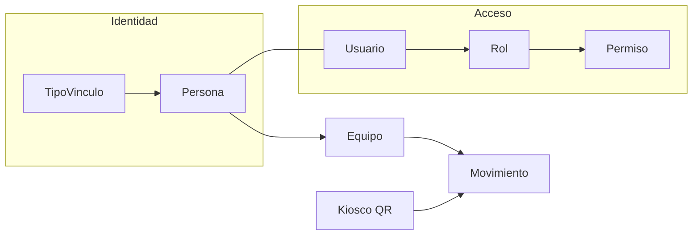

# Contexto completo del sistema

**Proyecto:** Sistema de Control de Salida de Equipos de Cómputo  
**Institución:** Universidad de Cundinamarca  
**Estado:** Vigente (síntesis operativa alineada al código y al seed)  
**Fecha:** 2026-09-19  

> **Punto de entrada canónico.** Si hay conflicto con documentos antiguos (`01`, `02`, `08`, etc.), **gana este archivo** y el código. Los `00`–`12` siguen como detalle; ver sección 14.

---

## 1. Qué es el sistema

La universidad controla la **salida** de equipos de cómputo (personales e institucionales) del campus:

1. Cada miembro de la comunidad registra sus equipos una vez.
2. Al salir, muestra un **código QR** (celular o pantalla).
3. En portería se escanea el QR y el sistema confirma si persona y equipo coinciden.

No hay control de ingreso. Cada escaneo genera un `Movimiento` (auditoría), incluso si hay alerta.

---

## 2. Stack y layout del repositorio

| Capa | Tecnología |
|------|------------|
| Backend | Python + Django 5.1 |
| Base de datos | PostgreSQL |
| Frontend | Templates Django + HTMX (sin SPA) |
| Estilos | `static/css/custom.css` + Bootstrap 5.3 (CDN) |
| QR | `qrcode` + Pillow; exhibición con token firmado TTL |
| Reportes | `xlsxwriter` (gráficos nativos Excel) |
| Auth extra | django-axes, Argon2, django-otp (MFA), django-ratelimit |

```
sistema de control/
├── config/                 # settings, urls, middleware, wsgi
├── apps/
│   ├── accounts/           # Usuario, Rol, Permiso, login, registro, MFA
│   ├── organizacion/       # Sede, Decanatura (Facultad), Programa, Área
│   ├── personas/           # Persona, TipoVinculo
│   ├── equipos/            # Equipo, QR
│   ├── control_acceso/     # Kiosco, Movimiento
│   ├── panel/              # Administración interna /panel/
│   ├── auditoria/          # AuditoriaCambio
│   └── reportes/           # Exportaciones Excel
├── templates/
├── static/
├── contexto/               # Documentación (este archivo = entrada)
└── manage.py
```

Comandos habituales:

```bash
python manage.py migrate
python manage.py seed_data
python manage.py runserver
```

---

## 3. Apps y responsabilidades

| App | Responsabilidad |
|-----|-----------------|
| `accounts` | Auth, roles/permisos dinámicos, registro externo, MFA TOTP, mi perfil |
| `organizacion` | Catálogos multi-sede: Sede, Facultad, Programa, Área |
| `personas` | Ficha de comunidad académica + TipoVinculo |
| `equipos` | Inventario, generación/exhibición de QR |
| `control_acceso` | Kiosco de portería + historial de movimientos |
| `panel` | CRUD interno (personas, usuarios, roles, organización) |
| `auditoria` | Traza de cambios sensibles y exportaciones |
| `reportes` | Cinco reportes `.xlsx` con filtros |

---

## 4. Identidad vs acceso

El sistema separa dos conceptos:

| Concepto | Pregunta | Entidades |
|----------|----------|-----------|
| **Identidad institucional** | ¿Quién es en la universidad? | `Persona` + `TipoVinculo` |
| **Acceso al sistema** | ¿Qué puede hacer en la app? | `Usuario` + `Rol` + `Permiso` |



- `Persona` no inicia sesión por sí sola; se vincula 1:1 opcional a `Usuario`.
- Un admin/operador puede ser `Usuario` sin `Persona`.
- Autorización: `usuario.tiene_permiso("codigo")` consulta roles activos → permisos.

---

## 5. Organización institucional

```
Sede ──────────────┐
Facultad (indep.) ─┼──► Programa (sede + facultad)
Área (indep.) ─────┤
                   ├──► Persona (sede + programa | área)
                   └──► Equipo (persona + dependencia opcional)
```

| Entidad | Descripción | Ejemplo seed |
|---------|-------------|--------------|
| **Sede** | Ubicación física | Seccional Ubaté |
| **Facultad** (`Decanatura`) | Unidad académica transversal (no depende de sede) | Facultad de Ingeniería |
| **Programa** | Carrera en una sede bajo una facultad | Ing. de Sistemas — Ubaté |
| **Área** | Dependencia administrativa | Biblioteca |

**Persona:** sede obligatoria; perfiles académicos pueden tener programa; administrativo (`gestor_administrativo`) tiene área (sin programa).

> Nota: docs antiguos `01`/`02` describían `Sede → Decanatura → Programa`. El modelo vigente trata Facultad como independiente.

---

## 6. Roles y permisos vigentes

Fuente canónica: `apps/accounts/management/commands/seed_data.py`.

### Roles

| Rol (BD) | Activo | Permisos |
|----------|--------|----------|
| `admin_sistema` | Sí | Todos (13) |
| `miembro_comunidad` | Sí | `equipos.registrar`, `equipos.ver_propios`, `perfil.ver_propio` |
| `celador` | **No** (legado MVP) | `control.escanear`, `control.ver_alertas` |

En el MVP actual, el **administrador** opera también el kiosco (tiene `control.escanear`). El rol celador existe en BD pero está inactivo.

### Permisos (13)

| Código | Uso |
|--------|-----|
| `equipos.registrar` | Alta de equipos propios |
| `equipos.ver_propios` | Ver/mostrar QR propio |
| `equipos.ver_todos` | Inventario completo |
| `control.escanear` | Kiosco de salida |
| `control.ver_alertas` | Historial / alertas |
| `catalogos.administrar` | Sedes, facultades, programas, áreas, vínculos |
| `personas.administrar` | CRUD personas |
| `usuarios.administrar` | Usuarios / reset password |
| `roles.administrar` | Roles + matriz |
| `permisos.ver` | Catálogo de permisos (solo lectura) |
| `perfil.ver_propio` | Mi perfil |
| `reportes.ver` | Ver/configurar reportes |
| `reportes.exportar` | Descargar Excel |

Los permisos se cargan por migración/seed; el panel no los crea, solo los asigna a roles.

---

## 7. TipoVinculo (perfiles universitarios)

Catálogo dinámico. **No es rol de acceso:** todos los que se autoregistran reciben `miembro_comunidad` vía `TipoVinculo.rol_asignado`.

| Código | Nombre visible | Autoregistro |
|--------|----------------|--------------|
| `gestor_conocimiento` | Gestor del Conocimiento | Sí |
| `creador_oportunidades` | Creador de Oportunidades | Sí |
| `egresado` | Egresado | Sí |
| `gestor_administrativo` | Administrativo | No (alta por panel) |

Dominio de correo institucional: `@ucundinamarca.edu.co`.

---

## 8. Entidades clave y reglas de negocio

### Equipo

- `serial` único en todo el sistema.
- `token_qr` UUID interno; el QR de exhibición usa token **firmado con TTL** (default 300 s).
- Propiedad: `personal` o `institucional` (esta última exige `dependencia` → Área).
- Si `activo=false`, el escaneo genera alerta.

### Movimiento

Cada escaneo crea un registro:

| Resultado | Significado |
|-----------|-------------|
| `ok` | Persona y equipo activos y coherentes |
| `alerta` | Inactivo u anomalía |
| `no_encontrado` | QR/serial inexistente |

### Reglas transversales

1. Un equipo tiene un único responsable (`Persona`).
2. Solo quien tiene `control.escanear` usa el kiosco.
3. Persona o equipo inactivo → no salida válida (alerta).
4. Borrado lógico (`activo`), no físico.
5. MFA obligatorio para usuarios con rol activo `admin_sistema`.

---

## 9. Flujos principales

### 9.1 Autorregistro (`/registro/` → `/accounts/registro/`)

Público. Elige `TipoVinculo` con `permite_autoregistro=true` → crea atómicamente Persona + Usuario + `UsuarioRol` (nunca elige su rol).

### 9.2 Login + MFA

`/accounts/login/` → Axes + rate limit. Si es `admin_sistema`: configurar o verificar TOTP antes de abrir sesión. Redirect post-login:

1. `control.escanear` → kiosco  
2. `equipos.ver_propios` → Mis equipos  
3. `perfil.ver_propio` → Mi perfil  
4. (otros permisos de panel…)

### 9.3 Miembro: equipos y QR

Login → Mis equipos → registrar equipo → al salir mostrar QR. Exhibición: `TimestampSigner` (`salt=equipo-qr-exhibicion`). Escaneo acepta token firmado, UUID legado o serial.

### 9.4 Kiosco de portería (`/acceso/control-salida/`)

Tres vías al mismo endpoint HTMX:

1. Pistola / lector (teclado + Enter)  
2. Cámara (`html5-qrcode`; HTTPS o localhost)  
3. Entrada manual  

Semáforo: verde (`ok`), rojo (`alerta`), gris (`no_encontrado`).

### 9.5 Panel interno (`/panel/`)

Administración universitaria (no Django Admin). Personas, usuarios, roles, organización. Django Admin (`ADMIN_URL`) solo soporte técnico.

### 9.6 Reportes (`/reportes/`)

Cinco Excel: movimientos, equipos, personas, alertas, ejecutivo. Requiere `reportes.ver` / `reportes.exportar`; cada descarga queda en auditoría. Export síncrono (límites documentados en doc `12`).

---

## 10. URLs principales

| Ruta | Destino |
|------|---------|
| `/` | Redirect al kiosco |
| `/registro/` | Autorregistro |
| `/legal/politica-datos/` | Política de datos personales |
| `{ADMIN_URL}` | Django admin (default `admin/`) |
| `/accounts/` | login, logout, registro, perfil, MFA |
| `/equipos/` | listado, mis-equipos, registrar, QR |
| `/acceso/` | kiosco + verificar-qr + histórico |
| `/panel/` | administración interna |
| `/reportes/` | índice / configurar / exportar |
| `/personas/` | personas + tipos de vínculo |

---

## 11. Seguridad (resumen)

| Control | Detalle |
|---------|---------|
| Contraseñas | Argon2 primero en `PASSWORD_HASHERS` |
| Bloqueo login | Axes: 5 fallos, cooloff 1 h (username+IP) |
| Rate limit | Login 5/m; escaneo 60/m |
| MFA | TOTP obligatorio para `admin_sistema` |
| CSP | Middleware propio; `frame-ancestors 'none'` |
| QR | Token de exhibición firmado + TTL |
| Admin path | `ADMIN_URL` por entorno |
| Sesión | 7200 s, HttpOnly; Secure en prod |
| Prod | `DEBUG=False`, HTTPS, HSTS, secretos obligatorios |
| Auditoría | `auditoria_cambio` (+ logs de rol en panel) |

Detalle: [`11-plan-seguridad-iso27001-owasp.md`](11-plan-seguridad-iso27001-owasp.md).  
Operación: [`operaciones/`](operaciones/) (incidentes, backups).

---

## 12. UX vigente (resumen)

| Principio | Práctica |
|-----------|----------|
| Marca | Verde `#007B3E` (~10–15% de pantalla) |
| Tipografía | Inter + JetBrains Mono (seriales/QR) |
| Modo | Claro fijo; sin dark mode |
| Layout | Desktop-first; offcanvas en móvil |
| Kiosco | Semáforo alto contraste a 1–2 m |
| Anti-patrones | Sin amarillo UCundinamarca en UI, sin emojis de estado |

Referencia visual: [`09-guia-diseno-ux-ui.md`](09-guia-diseno-ux-ui.md) + `static/css/custom.css`.

---

## 13. Seed MVP y acceso local

```bash
python manage.py seed_data
```

| Perfil | Usuario | Contraseña | Uso |
|--------|---------|------------|-----|
| Administrador | `admin` | `Udec2026!Admin` | Panel, catálogos, inventario, kiosco |

Carga: sede Ubaté, Facultad de Ingeniería, programa IS, área Biblioteca, 4 tipos de vínculo, 2 roles activos. Elimina demos (`celador1`, `docente1`, equipos demo) y deja `celador` inactivo.

> Credenciales solo para entorno local / presentación. En producción: cambiar y no documentar secretos reales.

---

## 14. Mapa a la documentación detallada

| Necesitas… | Ir a |
|------------|------|
| Este resumen (IA / onboarding) | **Este archivo** |
| Índice de toda la carpeta | [`README.md`](README.md) |
| Arquitectura inicial | [`00-arquitectura-general.md`](00-arquitectura-general.md) |
| Negocio / roles (histórico + reglas) | [`01-modelo-negocio-roles-permisos.md`](01-modelo-negocio-roles-permisos.md) |
| Diccionario de campos | [`02-modelo-datos-diccionario.md`](02-modelo-datos-diccionario.md) |
| Lógica ampliada (puede estar desfasada vs seed) | [`08-logica-completa-aplicacion.md`](08-logica-completa-aplicacion.md) |
| Guía UX/UI completa | [`09-guia-diseno-ux-ui.md`](09-guia-diseno-ux-ui.md) |
| Seguridad ISO/OWASP | [`11-plan-seguridad-iso27001-owasp.md`](11-plan-seguridad-iso27001-owasp.md) |
| Módulo reportes | [`12-modulo-reportes-excel.md`](12-modulo-reportes-excel.md) |
| Planes de ejecución | [`planes/`](planes/) |
| Incidentes / backups | [`operaciones/`](operaciones/) |

---

## Archivos de código clave

| Tema | Ruta |
|------|------|
| URLs raíz | `config/urls.py` |
| Settings / seguridad | `config/settings.py`, `config/middleware.py` |
| Seed | `apps/accounts/management/commands/seed_data.py` |
| Login / MFA / registro | `apps/accounts/views.py` |
| QR firmado | `apps/equipos/models.py` |
| Kiosco | `apps/control_acceso/views.py`, `templates/control_acceso/scanner.html` |
| Reportes | `apps/reportes/` |
