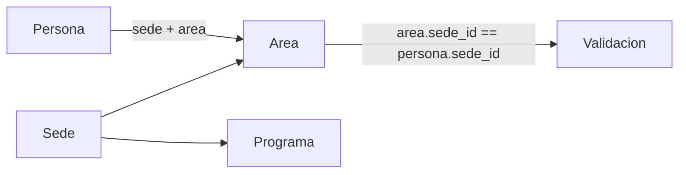

# Área pertenece a sede (obligatorio)

**Estado:** Completado  
**Fecha:** 2026-09-22  
**Documento rector / síntesis:** [`../contexto-completo-sistema.md`](../contexto-completo-sistema.md) §5 (organización)

## Objetivo

Cada **Área / Dependencia** (`organizacion.Area`) pertenece **obligatoriamente** a una **Sede**. El mismo código institucional (p. ej. `CGCA`, `ISU`) puede existir en varias sedes como filas distintas. Eso refleja la realidad operativa (Biblioteca / CGCA en Ubaté y en Fusagasugá, etc.) y alinea el catálogo con `Programa` (ya ligado a sede).

## Decisión de modelo

| Antes | Después |
|-------|---------|
| `Area.codigo` único **global** | `UniqueConstraint(fields=["sede", "codigo"])` |
| Área independiente de sede | `sede = ForeignKey(Sede, on_delete=RESTRICT, related_name="areas")` **NOT NULL** |
| `__str__` = `CGCA — nombre` | `CGCA — nombre (UBATE)` |



### Campos e índices

- FK `sede` + índice `area_sede_id_activo_idx` (`sede`, `activo`)
- Constraint `uniq_area_sede_codigo`
- Ordering: `sede__nombre`, `nombre`

## Migración `organizacion.0007_area_sede`

Secuencia:

1. Añadir `sede_id` **nullable**.
2. Quitar `unique` simple de `codigo`.
3. **RunPython `backfill_area_sede`:**
   - Si hay áreas sin sede y **no hay sedes** (caso test limpio: `equipos.0002` crea `CGCA` sin sedes), crea sede temporal `TMP-MIG` para poder continuar.
   - Asigna cada área original a la primera sede; **clona** `(codigo, nombre, activo)` por cada sede restante.
   - Remapea FKs:
     - `Persona.area_id` → área con mismo `codigo` y `sede_id = persona.sede_id`
     - `Equipo.dependencia_id` / `unidad_id` (si `unidad_tipo=area`)
     - `ResponsableDependencia` / `AlcanceUsuario` nivel área (según sede de la persona del usuario)
     - `VisitaExterno` con `unidad_tipo=area` → área de `visita.sede_id`
4. Hacer `sede` **non-null**; índice + `UniqueConstraint`.

**Producción (Render):** la migración ya se aplicó en deploy previo; el backfill dejó ~7 filas por código de área.

## Seed (`_cargar_areas`)

**Hotfix deploy (2026-09-22):** tras `0007`, `update_or_create(codigo=…)` provocaba `MultipleObjectsReturned: 7` y tumba el arranque.

Política vigente:

```text
para cada Sede activa × cada entrada de AREAS:
  update_or_create(sede=…, codigo=…, defaults={nombre, activo=True})
```

- **No** desactiva áreas creadas fuera del catálogo seed.
- Con 7 sedes × 8 códigos → **56** filas de área (log: `56 áreas upsert`).
- Catálogo de códigos: `seed_organizacion_data.AREAS` (`ADMIS`, `BIEN`, `CGCA`, `CTEI`, `DIRADM`, `INTL`, `ISU`, `TESOR`).

## Backend / validación

| Pieza | Comportamiento |
|-------|----------------|
| `panel/views_organizacion.area_form` | Sede obligatoria; unicidad `(sede, codigo)`; select `sedes_visibles`; crear/editar con `sede=` |
| `panel/views._apply_persona_fields` | Si hay área: `area.sede_id == persona.sede_id` + `puede_ver_objeto` |
| `accounts/alcance._q_area` | `Q(sede_id__in=alcance.sedes) \| Q(pk__in=alcance.areas)` |
| `areas_visibles` | `select_related("sede")` |
| `personas.services._validar_unidad` | Área (y programa) deben pertenecer a la sede de la visita |

## Frontend

| Template | Cambio |
|----------|--------|
| `area_form.html` | Select **Sede *** |
| `organizacion_list.html` | Columna sede |
| `persona_form.html` | `data-sede` en opciones; JS filtra áreas al cambiar sede |
| `registro.html` / `registrar_visita.html` | JSON `AREAS` con `sede`; filtro por `sedeId` si `unidad_tipo=area` |
| `responsable_form.html`, `usuario_detail.html`, `equipo_list.html` | Etiqueta `codigo — nombre (SEDE)` |

## Tests

- Creates de `Area` pasan `sede=`.
- `test_persona_rechaza_area_de_otra_sede`
- `test_mismo_codigo_area_en_sedes_distintas`
- Visita externa: área alineada a la sede destino
- Suite: `apps.accounts`, `apps.panel`, `apps.personas`, `apps.equipos` (OK)

## Checklist

- [x] Modelo `Area.sede` + `UniqueConstraint(sede, codigo)` + índice nombrado
- [x] Migración `0007_area_sede` (backfill, clones, remap FKs; sede temporal `TMP-MIG` si hace falta)
- [x] Seed upsert por `(sede, codigo)` × sedes activas (hotfix `MultipleObjectsReturned`)
- [x] Panel CRUD área con sede; listado con columna sede
- [x] Validación persona / visita / programa-área vs sede
- [x] Alcance `_q_area` por sede; filtros UI registro/visita/persona
- [x] Etiquetas con sede en selects de responsables / alcance / equipos
- [x] Tests y documentación (`contexto-completo-sistema.md` + índices)

## Criterio de listo

- Toda área tiene sede; CRUD exige sede.
- Persona/gestor solo elige áreas de **su** sede.
- Seed en Render no falla con áreas clonadas por sede.
- Migración remapea FKs cuando hay sede coincidente.
- `makemigrations --check` sin drift de índice.

## Despliegue (Render)

1. Push con seed corregido + UI/validación.
2. `migrate`: si `0007` ya aplicada → noop; si no, aplica backfill.
3. `seed_data`: debe loguear `N áreas upsert (7 sedes × 8 códigos, …)` **sin** traceback.
4. Verificar panel Organización → Áreas (columna sede) y asignar área a gestor solo de su sede.

## Archivos clave

| Pieza | Ruta |
|-------|------|
| Modelo | `apps/organizacion/models.py` → `Area` |
| Migración | `apps/organizacion/migrations/0007_area_sede.py` |
| Seed | `apps/accounts/management/commands/seed_data.py` → `_cargar_areas` |
| Datos | `…/seed_organizacion_data.py` → `AREAS` |
| Panel | `apps/panel/views_organizacion.py`, `views.py` |
| Alcance | `apps/accounts/alcance.py` → `_q_area` |
| Visitas | `apps/personas/services.py` |
